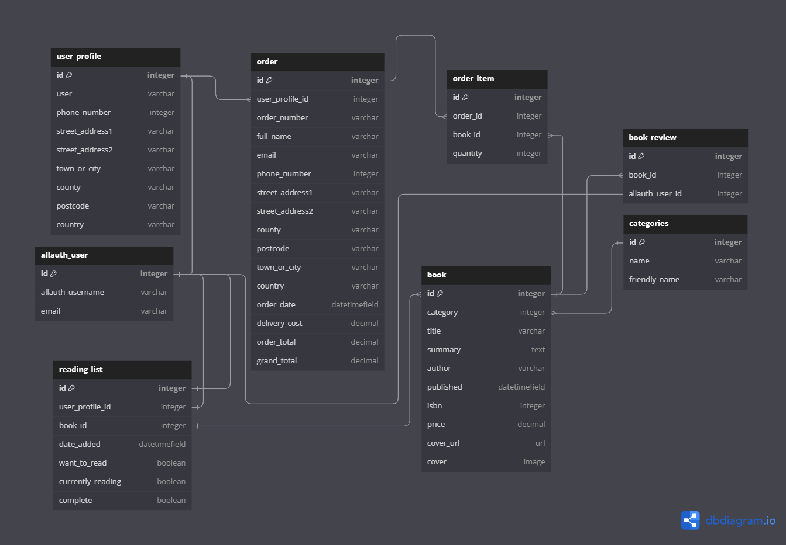

# 
**Bookmark-It**

[View the Bookmark-It live website here]()

# UX/UI

## Strategy

### Project Goals
Bookmark-It is a platform that combines the functionalities of an e-commerce bookstore with the book-tracking features similar to Goodreads. In addition to offering books for purchase, users can conveniently bookmark titles they are currently reading, plan to read, or have already completed.

For avid readers, Bookmark-It offers added convenience by integrating purchasing capabilities directly. This means users can seamlessly transition from browsing and bookmarking books to purchasing them, all within the same interface.

User profiles on Bookmark-It include a dedicated section that provides insights into the reader's reading habits. This feature allows users to track the number of books they've read over a specified period, whether it's monthly or yearly.

## Scope

### Feature Plan
| User                   | Feature                     | Importance | Viability | MVP | Complete |
| ---------------------- | --------------------------- | ---------- | --------- | --- | -------- |
| Site Visitor           | Register for an account     | 5          | 5         | MVP |          |
| Account Holder         | Password recovery           | 5          | 5         | MVP |          |
| Account Holder         | User Profile                | 4          | 5         | MVP |          |
| Account Holder         | Order history               | 4          | 5         |     |          |
| Account Holder         | Reading list                | 5          | 4         |     |          |
| Account Holder         | Reading goals               | 2          | 1         |     |          |
| Account Holder         | Reading tracker             | 4          | 4         |     |          |
| Account Holder         | Read book reviews           | 3          | 3         |     |          |
| Account Holder         | Leave book reviews          | 3          | 3         |     |          |
| Admin                  | Add books                   | 5          | 5         | MVP |          |
| Admin                  | Edit/update books           | 5          | 5         | MVP |          |
| Admin                  | Delete books                | 5          | 5         | MVP |          |
| Account Holder & Admin | Checkout                    | 5          | 5         | MVP |          |
| Account Holder & Admin | Stripe payments             | 5          | 5         | MVP |          |
| Account Holder & Admin | Order confirmation by email | 5          | 5         | MVP |          |
| All                    | Search & filter books       | 5          | 5         | MVP |          |
|                        | User Roles                  | 5          | 5         | MVP |          |
|                        |                             | 75         | 75        |     |          |

## Structure
### User Stories
| No: | As a...                          | I want to be able to                                         | so that I can                                                                         | Progress                |
| :-: | -------------------------------- | ------------------------------------------------------------ | ------------------------------------------------------------------------------------- | ----------------------- |
|     | **Viewing & Navigation**         |                                                              |                                                                                       |                         |
|  1  | site visitor / account holder    | navigate the website easily                                  | find books to purchase or bookmark.                                                   | Build  Test  Done |
|  2  | site visitor / account holder    | view different categories of books                           | find books that best suit my reading taste                                            | Build Test Done   |
|  3  | site visitor / account holder    | view individual book summaries                               | have an idea of what each book is about                                               | Build Test Done   |
|  4  | account holder                   | easily see books that I have selected to buy                 | amend my order                                                                        | Build Test Done   |
|  5  | account holder                   | easily see the total cost of books in my basket              | track my spending                                                                     | Build Test Done   |
|     | **Registration & User Accounts** |                                                              |                                                                                       |                         |
|  6  | site visitor                     | register for an account                                      | use the bookmark feature and use my saved details at checkout                         | Build Test Done   |
|  7  | account holder                   | receive confirmation email of account registration           | verify my account was created successfully                                            | Build Test Done   |
|  8  | account holder / admin           | log in and out of my account                                 | keep my account private and secure                                                    | Build Test Done   |
|  9  | account holder                   | view my profile                                              | amend my account details such as delivery address, password etc                       | Build Test Done   |
| 10  | account holder / admin           | reset my account password                                    | recover account                                                                       | Build Test Done   |
|     | **Searching & Filtering books**  |                                                              |                                                                                       |                         |
| 11  | site visitor / account holder    | sort books by category or price (low - high) / (high - low)  | easily identify books at a lower price and categories of books that I prefer          | Build Test Done   |
| 12  | site visitor / account holder    | search for a book by title, author or series (if applicable) | find a specific book, books by a specific author or a specific series                 | -Build Test Done  |
| 13  | site visitor / account holder    | easily see what I've searched for and the number or results  | quickly identify whether the book I'm looking for is available                        | Build Test Done   |
|     | Buying books & checkout          |                                                              |                                                                                       |                         |
| 14  | account holder                   | adjust quantity of books to add to basket                    | add more than one of the same book to my basket                                       | Build Test Done   |
| 15  | account holder                   | amend the quantity of a book when viewing my basket          | add another or remove one from the basket page itself                                 | Build Test Done   |
| 16  | account holder                   | easily identify where to remove books from my basket         | remove books if I change my mind                                                      | Build Test Done   |
| 17  | account holder                   | see cost breakdown and totals of books in basket             | review my spending                                                                    | Build Test Done   |
| 18  | account holder                   | see cost of delivery                                         | be aware of extra charges before payment                                              | Build Test Done   |
| 19  | account holder                   | see grand total or delivery + books                          | know the final amount that will be charged to my card                                 | Build Test Done   |
| 20  | account holder                   | easily enter my personal & payment information               | make the checkout process as convenient as possible                                   | Build Test Done   |
| 21  | account holder                   | receive email confirmation following successful checkout     | have a record of what I purchased                                                     | Build Test Done   |
|     | **Admin & Store Management**         |                                                              |                                                                                       |                         |
| 22  | admin                            | add new books                                                | upload new stock to the website                                                       | Build Test Done   |
| 23  | admin                            | edit book details                                            | make changes to the price, description, cover etc                                     | Build Test Done   |
| 24  | admin                            | delete books                                                 | remove books that are no longer for sale to ensure they're not accidentally purchased | Build Test Done   |
|     | **Bookmark**                         |                                                              |                                                                                       |                         |
| 25  | account holder                   | bookmark books                                               | keep track of books that I want to read                                               | Build Test Done   |
| 26  | account holder                   | update the progress of bookmarked books                      | easily differentiate between books I have read, I am reading or have yet to read      | Build Test Done   |
| 27  | account holder                   | set reading goals                                            | challenge myself to read more                                                         | Build Test Done   |
|     | **Book Ratings / reviews**           |                                                              |                                                                                       |                         |
| 28  | account holder                   | rate books that I have read  / bought                        | help others choose the best books to buy                                              | Build Test Done   |
| 29  | account holder                   | view reviews written by other users                          | make decisions on my own purchases                                                    | Build Test Done   |

### Database

## Skeleton
### Wireframes

### Books
**Mobile**

**Tablet**

**Desktop**

### Book Summary
**Mobile**

**Tablet**

**Desktop**

### Register
**Mobile**

**Tablet**

**Desktop**

### Login
**Mobile**

**Tablet**

**Desktop**

### Basket
**Mobile**

**Tablet**

**Desktop**

### Checkout
**Mobile**
**Tablet**
**Desktop**

### Checkout Success
**Mobile**
**Tablet**
**Desktop**

### Profile
**Mobile**
**Tablet**
**Desktop**

### Book Admin
**Mobile**
**Tablet**
**Desktop**

## Surface

# Features

# Technologies Used

## Languages
## Frameworks
## Database
## Libraries & Packages
## Payment System
## Programs

# Testing

# Deployment

# Future Features

# Known Bugs

# Citation

## Code
- Laura Mayock's codu article on Meta Tags.
[Meta Tags - All your work could be for nothing!](https://www.codu.co/articles/meta-tags-all-your-work-could-be-for-nothing-32p5y-ej)

- Niall Maher's codu article on CSS Reset.
[A Simple and Minimal CSS Reset](https://www.codu.co/articles/a-simple-and-minimal-css-reset-xc7ypizf)

- W3Schools JS matchmedia.
[JS Matchmedia](https://www.w3schools.com/howto/tryit.asp?filename=tryhow_js_matchmedia)

## Images

## Text