# <p style="text-align: center; font-size: 40px;">**Bookmark-It**</p>


[View the Bookmark-It live website here]()


# UX/UI

## Strategy

### Project Goals
Bookmark-It is a platform that combines the functionalities of an e-commerce bookstore with the book-tracking features similar to Goodreads. In addition to offering books for purchase, users can conveniently bookmark titles they are currently reading, plan to read, or have already completed.

For avid readers, Bookmark-It offers added convenience by integrating purchasing capabilities directly. This means users can seamlessly transition from browsing and bookmarking books to purchasing them, all within the same interface.

User profiles on Bookmark-It include a dedicated section that provides insights into the reader's reading habits. This feature allows users to track the number of books they've read over a specified period, whether it's monthly or yearly.

## Scope

### Feature Plan
| User                   | Feature                     | Importance | Viability | MVP | Complete |
| ---------------------- | --------------------------- | ---------- | --------- | --- | -------- |
| Site Visitor           | Register for an account     | 5          | 5         | MVP |    ✅    |
| Account Holder         | Password recovery           | 5          | 5         | MVP |    ✅    |
| Account Holder         | User Profile                | 4          | 5         | MVP |    ✅    |
| Account Holder         | Order history               | 4          | 5         |     |    ✅    |
| Account Holder         | Bookmark                    | 5          | 4         |     |    ✅    |
| Account Holder         | Reading goals               | 2          | 1         |     |          |
| Account Holder         | Reading tracker             | 4          | 4         |     |          |
| Account Holder         | Read book reviews           | 3          | 3         |     |          |
| Account Holder         | Leave book reviews          | 3          | 3         |     |          |
| Admin                  | Add books                   | 5          | 5         | MVP |    ✅    |
| Admin                  | Edit/update books           | 5          | 5         | MVP |    ✅    |
| Admin                  | Delete books                | 5          | 5         | MVP |    ✅    |
| Account Holder & Admin | Checkout                    | 5          | 5         | MVP |    ✅    |
| Account Holder & Admin | Stripe payments             | 5          | 5         | MVP |    ✅    |
| Account Holder & Admin | Order confirmation by email | 5          | 5         | MVP |          |
| All                    | Search & filter books       | 5          | 5         | MVP |    ✅    |
|                        | User Roles                  | 5          | 5         | MVP |    ✅    |
|                        |                             | 75         | 75        |     |          |

The order confirmation by email is something I have been unable to get working within the timeframe for the project.

Due to the size of the project and time constraints I have decided to leave **Reading Goals**, **Reading Tracker** and **Book Reviews** as future features.


## Structure
### User Stories
| No: | As a...                          | I want to be able to                                         | so that I can                                                                         | Progress                |
| :-: | -------------------------------- | ------------------------------------------------------------ | ------------------------------------------------------------------------------------- | ----------------------- |
|     | **Viewing & Navigation**         |                                                              |                                                                                       |                         |
|  1  | site visitor / account holder    | navigate the website easily                                  | find books to purchase or bookmark.                                                   | Build ✅ <br>Test ✅ <br>Done ✅ |
|  2  | site visitor / account holder    | view different categories of books                           | find books that best suit my reading taste                                            | Build ✅<br>Test ✅<br>Done ✅  |
|  3  | site visitor / account holder    | view individual book summaries                               | have an idea of what each book is about                                               | Build ✅<br>Test ✅<br>Done ✅   |
|  4  | account holder                   | easily see books that I have selected to buy                 | amend my order                                                                        | Build ✅<br>Test ✅<br>Done ✅   |
|  5  | account holder                   | easily see the total cost of books in my basket              | track my spending                                                                     | Build ✅ <br>Test ✅ <br>Done ✅   |
|     | **Registration & User Accounts** |                                                              |                                                                                       |                         |
|  6  | site visitor                     | register for an account                                      | use the bookmark feature and use my saved details at checkout                         | Build ✅<br>Test ✅<br>Done ✅   |
|  7  | account holder                   | receive confirmation email of account registration           | verify my account was created successfully                                            | Build ✅<br>Test ✅<br>Done ✅   |
|  8  | account holder / admin           | log in and out of my account                                 | keep my account private and secure                                                    | Build ✅<br>Test ✅<br>Done ✅   |
|  9  | account holder                   | view my profile                                              | amend my account details such as delivery address, password etc                       | Build ✅<br>Test ✅<br>Done ✅   |
| 10  | account holder / admin           | reset my account password                                    | recover account                                                                       | Build ✅<br>Test ✅<br>Done ✅   |
|     | **Searching & Filtering books**  |                                                              |                                                                                       |                         |
| 11  | site visitor / account holder    | sort books by category or price (low - high) / (high - low)  | easily identify books at a lower price and categories of books that I prefer          | Build ✅<br>Test ✅<br>Done ✅   |
| 12  | site visitor / account holder    | search for a book by title, author or series (if applicable) | find a specific book, books by a specific author or a specific series                 | -Build ✅<br>Test ✅<br>Done ✅  |
| 13  | site visitor / account holder    | easily see what I've searched for and the number or results  | quickly identify whether the book I'm looking for is available                        | Build ✅<br>Test ✅<br>Done ✅   |
|     | Buying books & checkout          |                                                              |                                                                                       |                         |
| 14  | account holder                   | adjust quantity of books to add to basket                    | add more than one of the same book to my basket                                       | Build ✅<br>Test ✅<br>Done ✅   |
| 15  | account holder                   | amend the quantity of a book when viewing my basket          | add another or remove one from the basket page itself                                 | Build ✅<br>Test ✅<br>Done ✅   |
| 16  | account holder                   | easily identify where to remove books from my basket         | remove books if I change my mind                                                      | Build ✅<br>Test ✅<br>Done ✅   |
| 17  | account holder                   | see cost breakdown and totals of books in basket             | review my spending                                                                    | Build ✅<br>Test ✅<br>Done ✅   |
| 18  | account holder                   | see cost of delivery                                         | be aware of extra charges before payment                                              | Build ✅<br>Test ✅<br>Done ✅   |
| 19  | account holder                   | see grand total or delivery + books                          | know the final amount that will be charged to my card                                 | Build ✅<br>Test ✅<br>Done ✅   |
| 20  | account holder                   | easily enter my personal & payment information               | make the checkout process as convenient as possible                                   | Build ✅<br>Test ✅<br>Done ✅  |
| 21  | account holder                   | receive email confirmation following successful checkout     | have a record of what I purchased                                                     | Build ✅ <br>Test<br>Done   |
|     | **Admin & Store Management**         |                                                              |                                                                                       |                         |
| 22  | admin                            | add new books                                                | upload new stock to the website                                                       | Build ✅<br>Test ✅<br>Done ✅   |
| 23  | admin                            | edit book details                                            | make changes to the price, description, cover etc                                     | Build ✅<br>Test ✅<br>Done ✅   |
| 24  | admin                            | delete books                                                 | remove books that are no longer for sale to ensure they're not accidentally purchased | Build ✅<br>Test ✅<br>Done ✅   |
|     | **Bookmark**                         |                                                              |                                                                                       |                         |
| 25  | account holder                   | bookmark books                                               | keep track of books that I want to read                                               | Build ✅<br>Test ✅<br>Done ✅  |
| 26  | account holder                   | update the progress of bookmarked books                      | easily differentiate between books I have read, I am reading or have yet to read      | Future Feature   |
| 27  | account holder                   | set reading goals                                            | challenge myself to read more                                                         | Future Feature   |
|     | **Book Ratings / reviews**           |                                                              |                                                                                       |                         |
| 28  | account holder                   | rate books that I have read  / bought                        | help others choose the best books to buy                                              | Future Feature   |
| 29  | account holder                   | view reviews written by other users                          | make decisions on my own purchases                                                    | Future Feature   |

### Database
First draft:

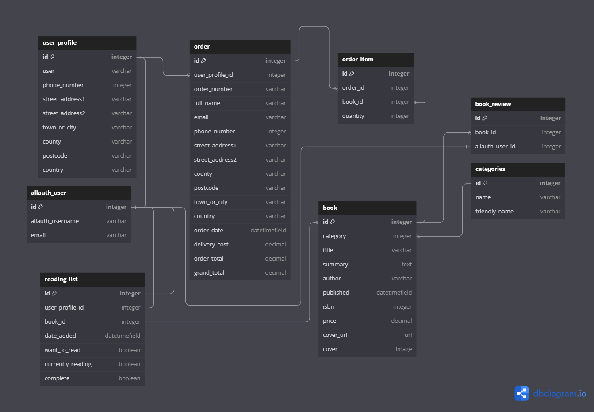

Second draft:

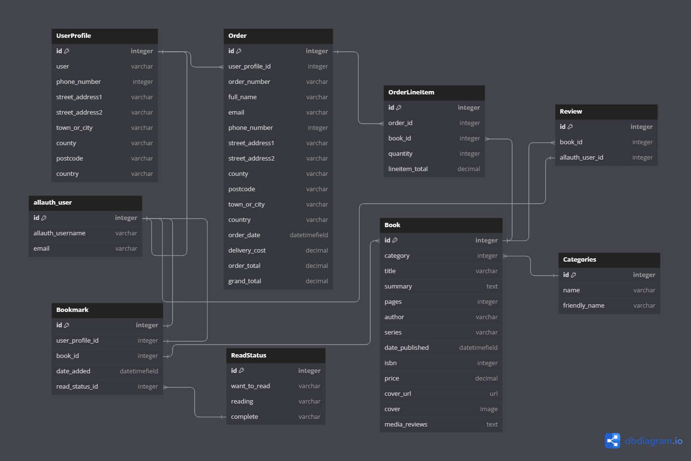
 
After a review of my books model I decided I could add some more information on the book summary page such as date published and price. The addition of Media Reviews allows the user to see how this book has been reviewed by other authors and works as a USP for the books. Adding in a series field allows the user to see if the book is part of a series. This prompted me to add the series_book_number field so the user can easily identify which number the book is in the series. No avid reader would want to start a series half way through unknowingly.

My mentor prompted me with questions on how the reading status would work. This helped me realise that by having the reading status categories directly in the Bookmark table the user would need to update all three options to True / False. I created a separate ReadingStatus table with the three options that has a one to many relationship with the Bookmark table allowing me to use a dropdown select.

I amended the table names to reflect as they would in my models.

I was missing lineitem_total on the OrderLineItem model and added this in.

Third draft:

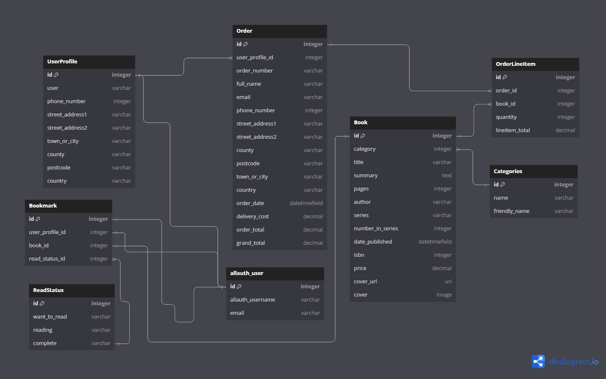

Due to time constraints I had to remove the book reviews. There are some additional fields added to books which I felt were necessary for the book summary page. 

## Skeleton
### Wireframes

Since completing the wireframes I decided not to add a footer to the website as it didn't add anything to the user experience.

### Books
**Mobile**


**Tablet**

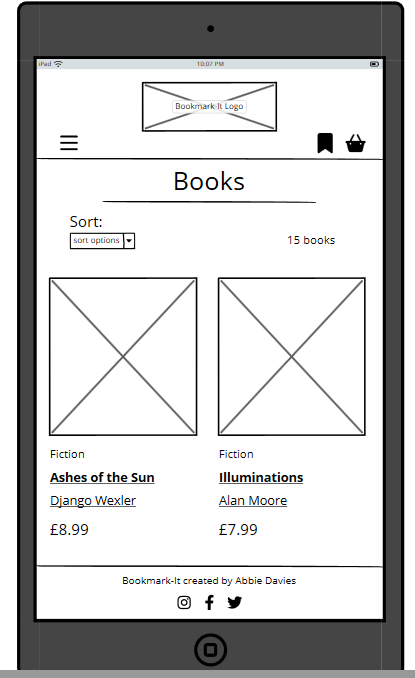

**Desktop**

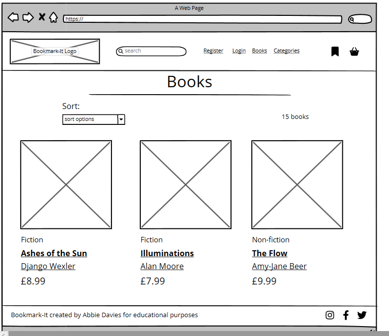

### Book Summary
**Mobile**

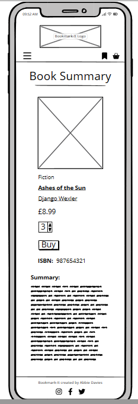

**Tablet**

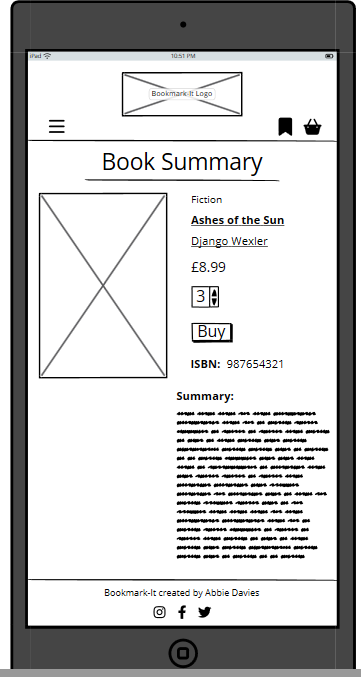

**Desktop**

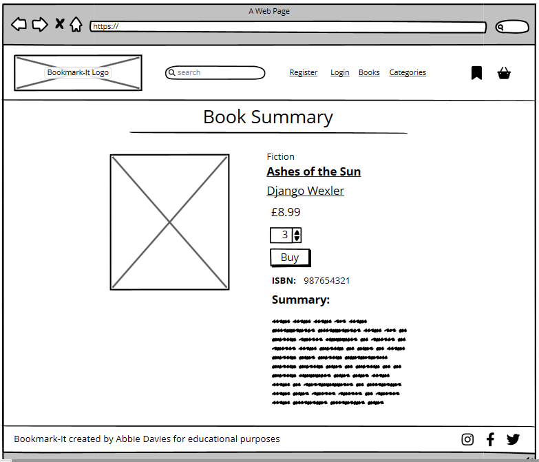

### Register
**Mobile**

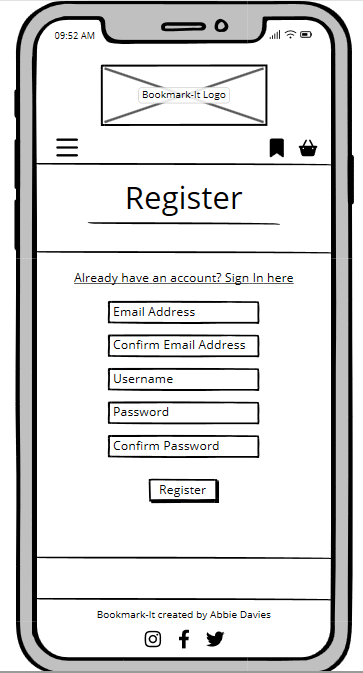

**Tablet**

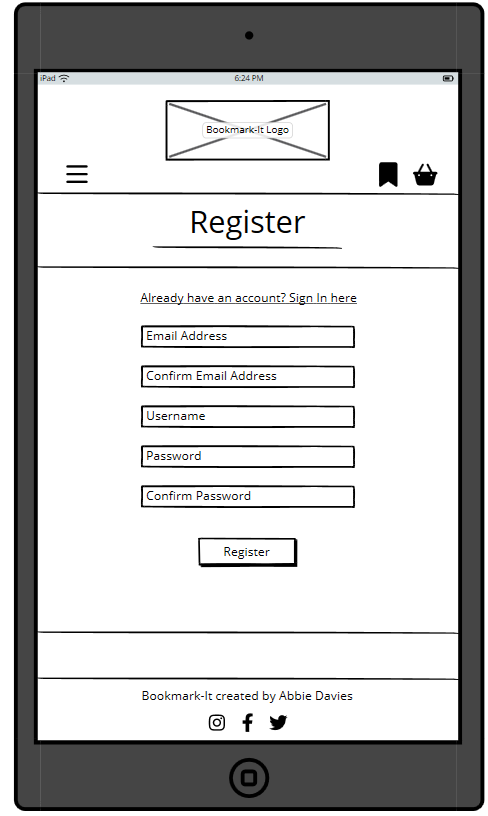

**Desktop**

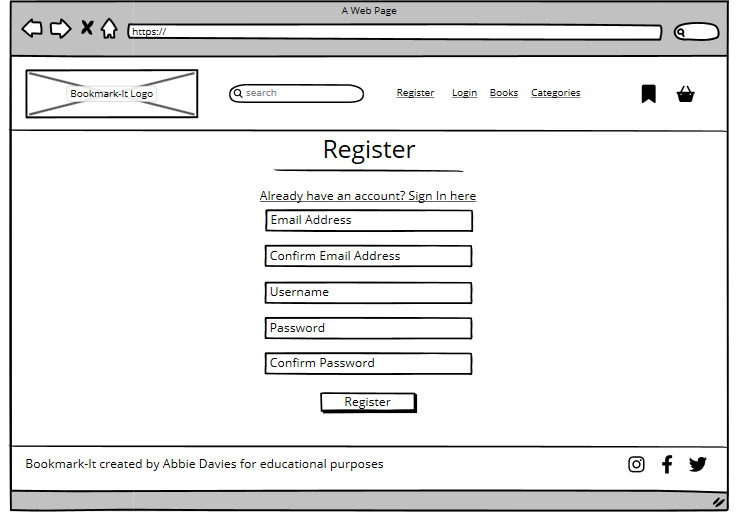

### Login
**Mobile**

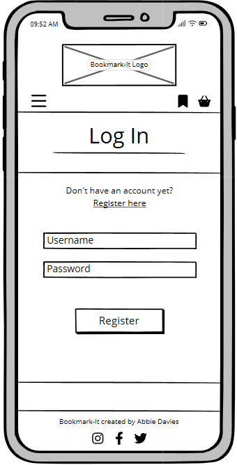

**Tablet**

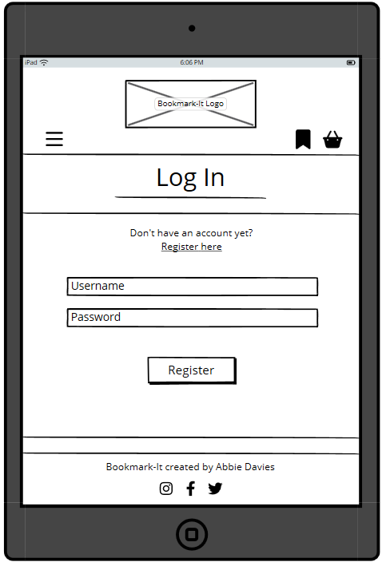

**Desktop**

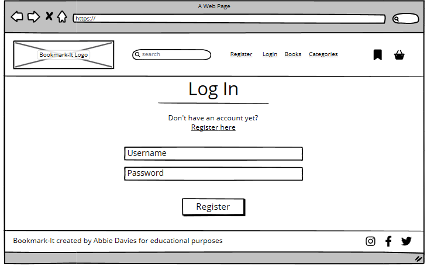

### Basket
**Mobile**

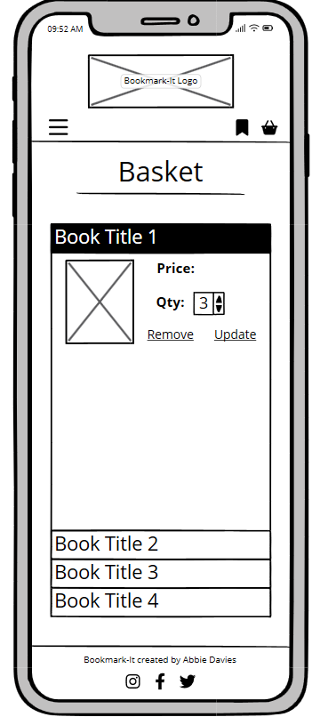

**Tablet**

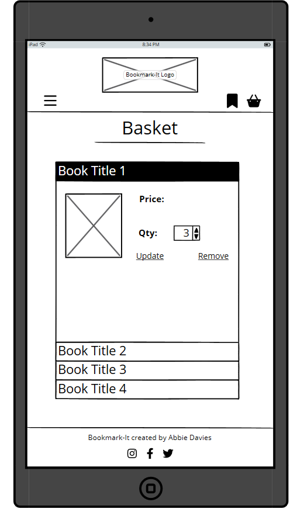

**Desktop**

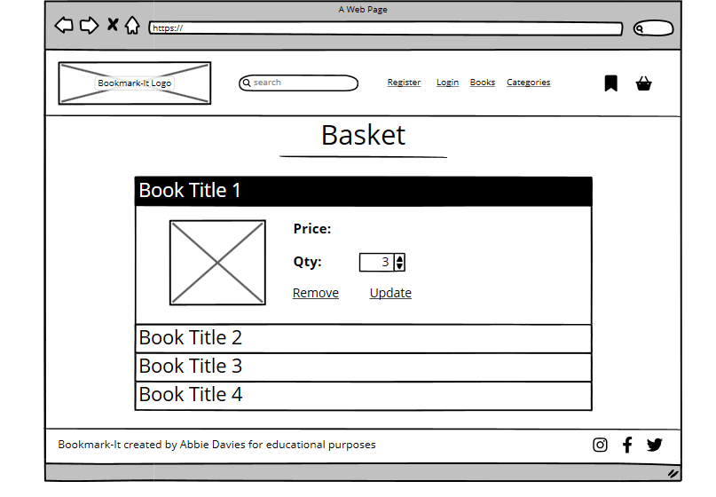

### Checkout
**Mobile**

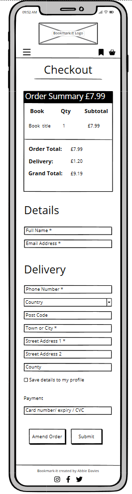

**Tablet**

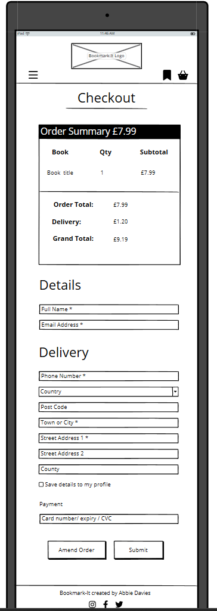

**Desktop**

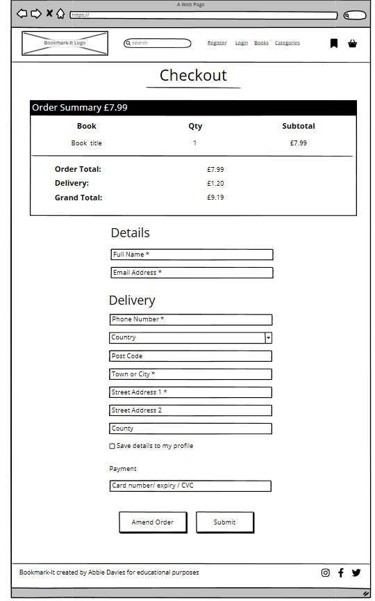

### Checkout Success
**Mobile**

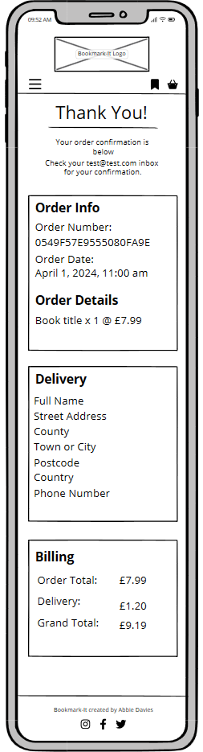

**Tablet**


**Desktop**


### Profile
**Mobile**

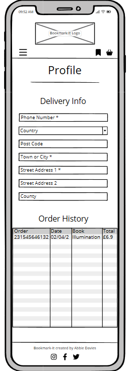

**Tablet**

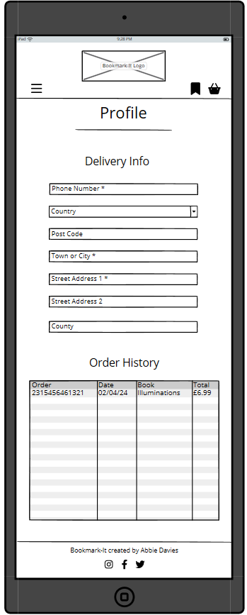

**Desktop**

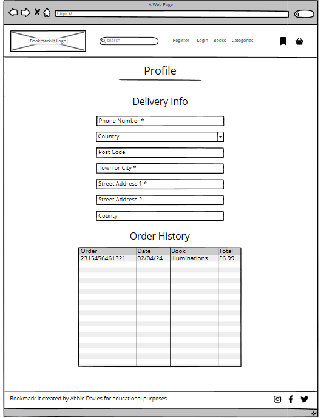

### Profile - bookmark
**Mobile**

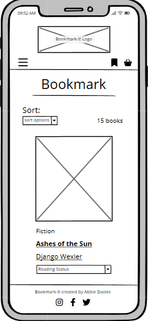

**Tablet**

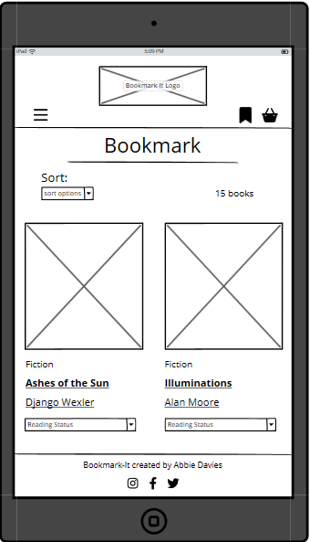

**Desktop**

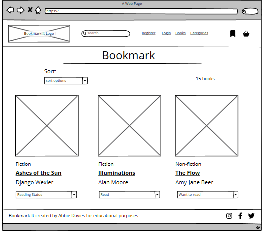

### Book Admin
**Mobile**

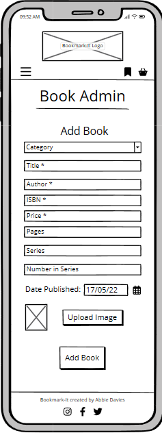

**Tablet**

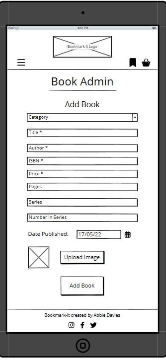

**Desktop**

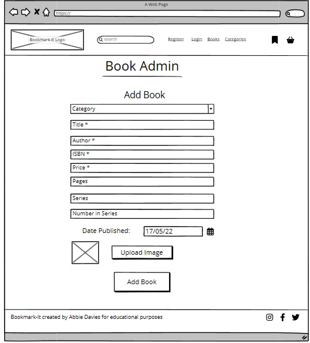

## Surface

# Features

# Technologies Used

## Languages
## Frameworks
## Database
## Libraries & Packages
## Payment System
## Programs

# Testing

# Deployment
Heroku was used to deploy this project. Follow the steps below to deploy.

## Create Database

1. Navigate to [ElephantSQL](https://www.elephantsql.com/) Dashboard and click the green **Create New Instance** button.

2. Choose a name for your plan and make sure the Tiny Turtle (free) plan is selected.

3. Double check your details are as you want them before clicking the green **Select Region** button in the bottom right.

4. Choose the region nearest to you and click the green **Review** button in the bottom right.

5. Check the details are all correct and click the green **Create Instance** button in the bottom right.

6. Navigate back to the Dashboard and click on the instance you created.

7. Find URL under detail and click **reveal** to see the full URL then click the copy button.

## Heroku Setup

1. Open your [Heroku dashboard](https://dashboard.heroku.com/). Click the **New** button the the top right.

2. Choose a unique name for your app, select the Region closest to you and click the purple **Create App** button in the bottom left.

3. Click the **Settings** tab, click the **Reveal Config Vars" button.

4. Add ```DATABASE_URL``` to the Key box and paste your Database URL in the Value box.

## Gitpod - Preperation for Deployment

1. In the terminal install dj_database_url and psycopg2:

    ```pip3 install dj_database_url==0.5.0 psycopg2```

2. Update requirements.txt file with dj_database_url and psycopg2

    ```pip3 freeze > requirements.txt```

3. Open **settings.py** and import dj_database_url under your OS import

    ```import dj_database_url```

4. Scroll down to Databases section. You'll find the following code and comment it out (**Do NOT Delete**):

    ```
    DATABASES = {
        'default': {
            'ENGINE': 'django.db.backends.sqlite3',
            'NAME': BASE_DIR / 'db.sqlite3',
        }
    }
    ```

5. Copy the following and replace **paste-elephantsql-db-url-here** with your own DATABASE URL.
    ```
    DATABASES = {
        'default': dj_database_url.parse('paste-elephantsql-db-url-here')
    }
    ```
6. Run ```python3 manage.py runserver`` in the terminal. You should see a message saying you have unapplied migrations. If you don't see this message revisit the steps above as you haven't connected to your database correctly.

7. If you do see the message along with a list of migrations run ```python3 manage.py migrate``` in the terminal to make these migrartions.

8. If you have JSON fixtures with your products you now need to load the data to your new database with. Be sure to start with categories first and then your products.
    ```python3 manage.py loaddata fixture-name```

9. Run ```python3 manage.py createsuperuser``` to create a superuser for your database. You will see a prompt in the terminal to enter a Username followed by Email and then Password.

10. To check that your superuser was created successfully navigate back to [ElephantSQL](https://www.elephantsql.com/), select **Browser** from the options on the left, click **Table Queries**, select **auth_user** and click the blue **Execute** button. You should see your username and email along with a hashed password.

11. Paste the below if else statement in the Databases section of **settings.py** to use the development database when in development mode and the external database for the live website.
    ```
    if 'DATABASE_URL' in os.environ:
    DATABASES = {
      'default': dj_database_url.parse(os.environ.get('DATABASE_URL'))
    }
else:
    DATABASES = {
        'default': {
            'ENGINE': 'django.db.backends.sqlite3',
            'NAME': os.path.join(BASE_DIR, 'db.sqlite3')
      }
    }
    ```

12. We'll use Gunicorn to act as our webserver. Paste the following into the terminal to install.
   
    ```pip3 install gunicorn```

13. Add Gunicorn to requirements.txt with ```pip freeze > requirements.txt```

14. Create a ```Procfile```, this needs to be in the root directory and add the following and change "enter-project-name-from-wsgi":

    ```web: gunicorn enter-project-name-from-wsgi.wsgi:application```

15. Open a new terminal window and run the ```heroku login``` command. If Heroku is installed the message "Press any key to open up the browser to login or q to exit:" will display. Press any key.

16. A new window will open with a big purple **Log In** button, click the button and a message will display "Logged In". You can return to gitpod and the terminal will display the user that you're logged in under.

17. Run the following to tell Heroku not to collect our Static Files:

    ```heroku config:set DISABLE_COLLECTSTATIC=1 --app heroku-app-name-here```

18. Add your Heroku live site URL to the ALLOWED HOSTS section of settings.py. Note don't include https:// or a trailing slash at the end.

    ```ALLOWED_HOSTS = ['{your deployed site URL}', 'localhost' ]```

19. Commit and push all changes to GitHub.

20. Enter the following in the terminal to initialize the Heroku git remote:

    ```heroku git:remote -a {app name here}```

21. Enter ```git push heroku main``` to push to Heroku, head to Heroku and click **Open App**. Your app should load without static files.

22. Link Heroku to your GitHub respository by heading to the **Deploy** tab, click the GitHub logo under **Deployment Method**, search for your repository name under **App connected to GitHub**.

23. When your repository is linked there will be an option below to set up automatic deploys from your selected branch. Note: It's considered best practice to deploy from your main branch.

24. If you opt for manual deploys you will need to head to the manual deploy and click **Deploy Branch** each time you push new commits to GitHub.

## Setting a new Secret Key
1. We need to change the auto generated secret key by heading to [Djecrety](https://djecrety.ir/). This is a random key generator. 

2. Copy the new key you generated, head to Heroku **Settings** tab and click **Reaveal Config Vars**

3. Add ```SECRET_KEY``` in the **Key** box and paste your new secret key in the **Value** box.

4. Open settings.py and amend the SECRET_KEY variable to the following:

     ```SECRET_KEY = os.environ.get('SECRET_KEY', ' ')  ```

5. Change the **DEBUG = True** variable to ```DEBUG = 'DEVELOPMENT' in os.environ```

6. Commit and push changes.

## Amazon Web Services (AWS) Setup

1. Navigate to [AWS](https://aws.amazon.com/console/), click **Sign In to the Console** in the top right corner. If you already have an account, sign in or click **Create a new AWS account**.

2. Using the search bar search for "S3" and click the first option "S3 - scalable storage in the cloud".

3. Click the yellow **Create Bucket** button, choose the Region closest to you and select a name for your bucket (preferably the same as your project). 

4. Select **ACLs enabled** and **Bucket Owner Preferred** under **Object Ownership**

5. Uncheck the **Block Public Access** box and check the following statement:
    "I acknowledge that the current settings might result in this bucket and the objects within becoming public."

6. Click the yellow **Create Bucket** button.

7. Click your bucket and navigate to the **Properties** tab, scroll to the bottom to **Static Web Hosting**. It will be Disabled by default, change it to Enabled.

8. Select **Host Static website**, enter index.html and error.html for Index document and Error document and click **Save Changes**.

9. Head to the **Permissions** tab, scroll down to **Cross-origin resource sharing (CORS)** section and paste the following
    ```
    [
        {
        "AllowedHeaders": [
            "Authorization"
        ],
        "AllowedMethods": [
            "GET"
        ],
        "AllowedOrigins": [
            "*"
        ],
        "ExposeHeaders": [
        ]
        }
    ]
    ```
10. Add the following for **Bucket Policy**:
    ```
        {
    "Version": "2012-10-17",
    "Statement": [
        {
            "Sid": "Statement1",
            "Effect": "Allow",
            "Principal": "*",
            "Action": "s3:*",
            "Resource": [
                "arn:aws:s3:::your-bucket-name",
                "arn:aws:s3:::your-bucket-name/*"
            ]
        }
    ]
}
    ```

11. In the **Access Control List** section click **Edit** and enable **List** for **Everyone(public access**). Be sure to check the "I understand the effects of these changes on my objects and buckets" box before clicking **Save**.

12. Now search **IAM** in the search bar and select the first option.

13. Click **User Groups** on the left and click **Create Group**. Choose a name for your group, I chose manage-bookmark-it.
Click **Create Group**

14. Select the **Policies** section from the left hand menu and click **Create Policy**. Click the **JSON** tab, click **Actions** dropdown and select **Import Policy**. Enter **S3** in the search bar and select **AmazonS3FullAccess**, click **Import Policy**.

15. Open a new tab also with **AWS** and navigate to the **S3** service. Select your bucket and click **Properties**. Here you will find the **Amazon Resource Name (ARN)** which you need to copy.

16. Go back to your tab with **IAM** open on the Create Policy page. In the **Policy Editor** paste your **ARN** in the resources key. Paste your key twice and add /* to the second one. Add **"s3:*"** to the action key and click **Next**.

17. Enter a Policy name and description and click **Create Policy**. You will be taken back to the policies page and should see a green banner at the top confirming your new policy has been created.

18. Head to **User Groups** on the left hand menu, click your group, click **Permissions**, click the **Add Permissions**  dropdown and click **Attach Policies**.

19. Search for the name of your policy, select it and click **Attach Policies**

20. Select **Users** from the left hand menu, click **Create User**. Follow this convention for the user name 

    ```your-app-name-staticfiles-user```

21. Click **Next**. On the Set Permissions page select your policy to add a user then click **Next**. Nothing else needs changing so click **Create User**.

22. Click **Users** and select the user you just created and select the **Security Credentials** tab. Scroll down to access keys and click **Create Access Key**. Select **Other** from the list of options and click **Next**. On the next page click **Create Access Key** and then click **Download .csv file** and click **Done**.

## Connecting Django to S3

1. Install the following packages in the terminal

    ```
    pip3 install boto3
    pip3 install django-storages
    ```
2. Updates requirements.txt ```pip freeze > requirements.txt```

3. In **settings.py** **INSTALLED APPS** add storages.

4. Add the following in **settings.py** 

    ```
    if 'USE_AWS' in os.environ:
    # Bucket Config
    AWS_STORAGE_BUCKET_NAME = 'your-bucket-name-here'
    AWS_S3_REGION_NAME = 'your-region-here'
    AWS_ACCESS_KEY_ID = os.environ.get('AWS_ACCESS_KEY_ID')
    AWS_SECRET_ACCESS_KEY = os.environ.get('AWS_SECRET_ACCESS_KEY')
    AWS_S3_CUSTOM_DOMAIN = f'{AWS_STORAGE_BUCKET_NAME}.s3.amazonaws.com'
    ```

5. Head to Heroku, **settings** and under **Reveal Config Vars** add the following:
    - AWS_ACCESS_KEY_ID - Enter your access key id from the .csv file you downloaded
    - AWS_SECRET_ACCESS_KEY  - Enter your secret access key from the .csv file you downloaded
    - USE_AWS - True

6. You can delete the DISABLE_COLLECTSTATIC variable.

7. In your root directory create a file called **custom_storages.py** and add the following to give the app a location to store static and media files:

    ```
    from django.conf import settings
    from storages.backends.s3boto3 import S3Boto3Storage


    class StaticStorage(S3Boto3Storage):
        location = settings.STATICFILES_LOCATION


    class MediaStorage(S3Boto3Storage):
        location = settings.MEDIAFILES_LOCATION
    ```

8. In **settings.py** add the following under the bucket config if statement to tell the app where to store STATIC and MEDIA files and to override the URLs if in production.

    ```
    # Static and media files
    STATICFILES_STORAGE = 'custom_storages.StaticStorage'
    STATICFILES_LOCATION = 'static'
    DEFAULT_FILE_STORAGE = 'custom_storages.MediaStorage'
    MEDIAFILES_LOCATION = 'media'

    # Override static and media URLs in production
    STATIC_URL = f'https://{AWS_S3_CUSTOM_DOMAIN}/{STATICFILES_LOCATION}/'
    MEDIA_URL = f'https://{AWS_S3_CUSTOM_DOMAIN}/{MEDIAFILES_LOCATION}/'
    ```

9. Commit and push all changes. If you selected automatic deploys these changes will automatically synch with Heroku. If not, head to the **Deploy** tab in Heroku and navigate down to manual deployment and click **Deploy Branch**.

10. Head to the **Overview** tab in Heroku, under **Latest Activity** click the **view build log** link. Here you should see if your static files were copied.

11. Head to your S3 bucket in **AWS**, refresh and you should see the static folder. Click **Create Folder**, call the folder **media** and click **Create Folder**.

12. Click the new **media** folder, click **Upload**, click **Add Files** and select your product images.

13. Scroll down to **Permissions** click on it and select "Grant public-read access" and accept the warning. Click **Upload**


# Future Features

# Known Bugs
- Confirmation emails for purchases not sending but account verification and password reset emails are.

- After hitting major setbacks with emails and deployment sadly this is currently in an unfinished state.

# Citation

## Code
- Laura Mayock's codu article on Meta Tags.
[Meta Tags - All your work could be for nothing!](https://www.codu.co/articles/meta-tags-all-your-work-could-be-for-nothing-32p5y-ej)

- Niall Maher's codu article on CSS Reset.
[A Simple and Minimal CSS Reset](https://www.codu.co/articles/a-simple-and-minimal-css-reset-xc7ypizf)

- Katherine Kato's CSS Tricks article on amimations.
[4 Ways to Animate the Color of a Text Link on Hover](https://css-tricks.com/4-ways-to-animate-the-color-of-a-text-link-on-hover/)

- W3Schools JS matchmedia.
[JS Matchmedia](https://www.w3schools.com/howto/tryit.asp?filename=tryhow_js_matchmedia)

- Code Institute Boutique Ado walkthrough & AJ Greaves commit record for bug fix.
[AJ Greaves commit record ](https://github.com/Code-Institute-Solutions/boutique_ado_v1/commit/de7ad2067ac1b5de37a4cd8b9f4ddf572a4bf6c7)

- BugBytes' Django Crispy Forms video to assign the date picker to the published field of the add book form.
[Building Django forms with django-crispy-forms](https://www.youtube.com/watch?v=MZwKoi0wu2Q&t=358s)