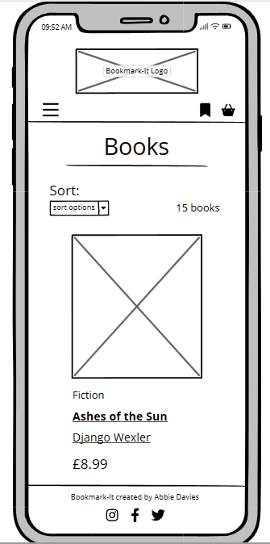
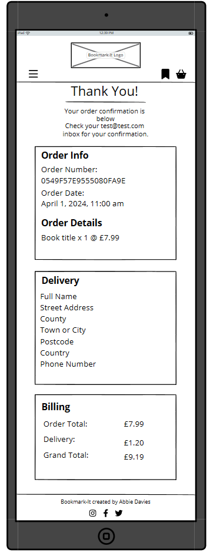
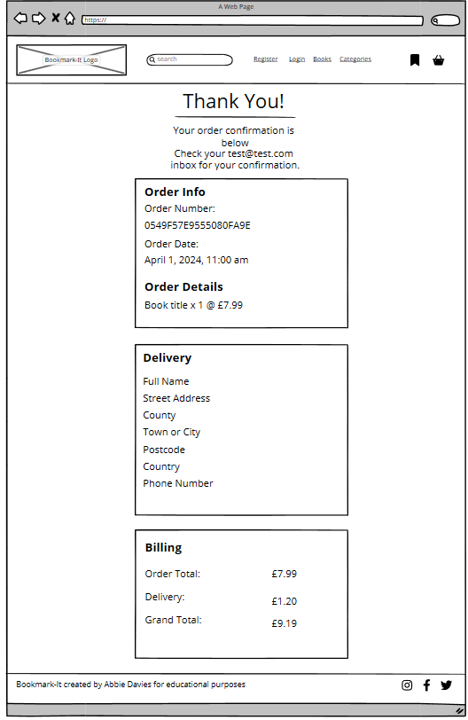

# <p style="text-align: center; font-size: 40px;">**Bookmark-It**</p>


[View the Bookmark-It live website here]()


# UX/UI

## Strategy

### Project Goals
Bookmark-It is a platform that combines the functionalities of an e-commerce bookstore with the book-tracking features similar to Goodreads. In addition to offering books for purchase, users can conveniently bookmark titles they are currently reading, plan to read, or have already completed.

For avid readers, Bookmark-It offers added convenience by integrating purchasing capabilities directly. This means users can seamlessly transition from browsing and bookmarking books to purchasing them, all within the same interface.

User profiles on Bookmark-It include a dedicated section that provides insights into the reader's reading habits. This feature allows users to track the number of books they've read over a specified period, whether it's monthly or yearly.

## Scope

### Feature Plan
| User                   | Feature                     | Importance | Viability | MVP | Complete |
| ---------------------- | --------------------------- | ---------- | --------- | --- | -------- |
| Site Visitor           | Register for an account     | 5          | 5         | MVP |          |
| Account Holder         | Password recovery           | 5          | 5         | MVP |          |
| Account Holder         | User Profile                | 4          | 5         | MVP |          |
| Account Holder         | Order history               | 4          | 5         |     |          |
| Account Holder         | Reading list                | 5          | 4         |     |          |
| Account Holder         | Reading goals               | 2          | 1         |     |          |
| Account Holder         | Reading tracker             | 4          | 4         |     |          |
| Account Holder         | Read book reviews           | 3          | 3         |     |          |
| Account Holder         | Leave book reviews          | 3          | 3         |     |          |
| Admin                  | Add books                   | 5          | 5         | MVP |          |
| Admin                  | Edit/update books           | 5          | 5         | MVP |          |
| Admin                  | Delete books                | 5          | 5         | MVP |          |
| Account Holder & Admin | Checkout                    | 5          | 5         | MVP |          |
| Account Holder & Admin | Stripe payments             | 5          | 5         | MVP |          |
| Account Holder & Admin | Order confirmation by email | 5          | 5         | MVP |          |
| All                    | Search & filter books       | 5          | 5         | MVP |          |
|                        | User Roles                  | 5          | 5         | MVP |          |
|                        |                             | 75         | 75        |     |          |


## Structure
### User Stories
| No: | As a...                          | I want to be able to                                         | so that I can                                                                         | Progress                |
| :-: | -------------------------------- | ------------------------------------------------------------ | ------------------------------------------------------------------------------------- | ----------------------- |
|     | **Viewing & Navigation**         |                                                              |                                                                                       |                         |
|  1  | site visitor / account holder    | navigate the website easily                                  | find books to purchase or bookmark.                                                   | Build <br>Test <br>Done |
|  2  | site visitor / account holder    | view different categories of books                           | find books that best suit my reading taste                                            | Build<br>Test<br>Done   |
|  3  | site visitor / account holder    | view individual book summaries                               | have an idea of what each book is about                                               | Build<br>Test<br>Done   |
|  4  | account holder                   | easily see books that I have selected to buy                 | amend my order                                                                        | Build<br>Test<br>Done   |
|  5  | account holder                   | easily see the total cost of books in my basket              | track my spending                                                                     | Build<br>Test<br>Done   |
|     | **Registration & User Accounts** |                                                              |                                                                                       |                         |
|  6  | site visitor                     | register for an account                                      | use the bookmark feature and use my saved details at checkout                         | Build<br>Test<br>Done   |
|  7  | account holder                   | receive confirmation email of account registration           | verify my account was created successfully                                            | Build<br>Test<br>Done   |
|  8  | account holder / admin           | log in and out of my account                                 | keep my account private and secure                                                    | Build<br>Test<br>Done   |
|  9  | account holder                   | view my profile                                              | amend my account details such as delivery address, password etc                       | Build<br>Test<br>Done   |
| 10  | account holder / admin           | reset my account password                                    | recover account                                                                       | Build<br>Test<br>Done   |
|     | **Searching & Filtering books**  |                                                              |                                                                                       |                         |
| 11  | site visitor / account holder    | sort books by category or price (low - high) / (high - low)  | easily identify books at a lower price and categories of books that I prefer          | Build<br>Test<br>Done   |
| 12  | site visitor / account holder    | search for a book by title, author or series (if applicable) | find a specific book, books by a specific author or a specific series                 | -Build<br>Test<br>Done  |
| 13  | site visitor / account holder    | easily see what I've searched for and the number or results  | quickly identify whether the book I'm looking for is available                        | Build<br>Test<br>Done   |
|     | Buying books & checkout          |                                                              |                                                                                       |                         |
| 14  | account holder                   | adjust quantity of books to add to basket                    | add more than one of the same book to my basket                                       | Build<br>Test<br>Done   |
| 15  | account holder                   | amend the quantity of a book when viewing my basket          | add another or remove one from the basket page itself                                 | Build<br>Test<br>Done   |
| 16  | account holder                   | easily identify where to remove books from my basket         | remove books if I change my mind                                                      | Build<br>Test<br>Done   |
| 17  | account holder                   | see cost breakdown and totals of books in basket             | review my spending                                                                    | Build<br>Test<br>Done   |
| 18  | account holder                   | see cost of delivery                                         | be aware of extra charges before payment                                              | Build<br>Test<br>Done   |
| 19  | account holder                   | see grand total or delivery + books                          | know the final amount that will be charged to my card                                 | Build<br>Test<br>Done   |
| 20  | account holder                   | easily enter my personal & payment information               | make the checkout process as convenient as possible                                   | Build<br>Test<br>Done   |
| 21  | account holder                   | receive email confirmation following successful checkout     | have a record of what I purchased                                                     | Build<br>Test<br>Done   |
|     | **Admin & Store Management**         |                                                              |                                                                                       |                         |
| 22  | admin                            | add new books                                                | upload new stock to the website                                                       | Build<br>Test<br>Done   |
| 23  | admin                            | edit book details                                            | make changes to the price, description, cover etc                                     | Build<br>Test<br>Done   |
| 24  | admin                            | delete books                                                 | remove books that are no longer for sale to ensure they're not accidentally purchased | Build<br>Test<br>Done   |
|     | **Bookmark**                         |                                                              |                                                                                       |                         |
| 25  | account holder                   | bookmark books                                               | keep track of books that I want to read                                               | Build<br>Test<br>Done   |
| 26  | account holder                   | update the progress of bookmarked books                      | easily differentiate between books I have read, I am reading or have yet to read      | Build<br>Test<br>Done   |
| 27  | account holder                   | set reading goals                                            | challenge myself to read more                                                         | Build<br>Test<br>Done   |
|     | **Book Ratings / reviews**           |                                                              |                                                                                       |                         |
| 28  | account holder                   | rate books that I have read  / bought                        | help others choose the best books to buy                                              | Build<br>Test<br>Done   |
| 29  | account holder                   | view reviews written by other users                          | make decisions on my own purchases                                                    | Build<br>Test<br>Done   |

### Database
First draft:


Second draft:


 
After a review of my books model I decided I could add some more information on the book summary page such as date published and price. The addition of Media Reviews allows the user to see how this book has been reviewed by other authors and works as a USP for the books. Adding in a series field allows the user to see if the book is part of a series. This prompted me to add the series_book_number field so the user can easily identify which number the book is in the series. No avid reader would want to start a series half way through unknowingly.

My mentor prompted me with questions on how the reading status would work. This helped me realise that by having the reading status categories directly in the Bookmark table the user would need to update all three options to True / False. I created a separate ReadingStatus table with the three options that has a one to many relationship with the Bookmark table allowing me to use a dropdown select.

I amended the table names to reflect as they would in my models.

I was missing lineitem_total on the OrderLineItem model and added this in.


## Skeleton
### Wireframes

### Books
**Mobile**



**Tablet**


**Desktop**


### Book Summary
**Mobile**


**Tablet**


**Desktop**


### Register
**Mobile**


**Tablet**


**Desktop**


### Login
**Mobile**


**Tablet**


**Desktop**


### Basket
**Mobile**


**Tablet**


**Desktop**


### Checkout
**Mobile**


**Tablet**


**Desktop**


### Checkout Success
**Mobile**


**Tablet**



**Desktop**



### Profile
**Mobile**
**Tablet**
**Desktop**

### Book Admin
**Mobile**
**Tablet**
**Desktop**

## Surface

# Features

# Technologies Used

## Languages
## Frameworks
## Database
## Libraries & Packages
## Payment System
## Programs

# Testing

# Deployment
Heroku was used to deploy this project. Follow the steps below to deploy.

## Create Database

1. Navigate to [ElephantSQL](https://www.elephantsql.com/) Dashboard and click the green **Create New Instance** button.

2. Choose a name for your plan and make sure the Tiny Turtle (free) plan is selected.

3. Double check your details are as you want them before clicking the green **Select Region** button in the bottom right.

4. Choose the region nearest to you and click the green **Review** button in the bottom right.

5. Check the details are all correct and click the green **Create Instance** button in the bottom right.

6. Navigate back to the Dashboard and click on the instance you created.

7. Find URL under detail and click **reveal** to see the full URL then click the copy button.

## Heroku Setup

1. Open your [Heroku dashboard](https://dashboard.heroku.com/). Click the **New** button the the top right.

2. Choose a unique name for your app, select the Region closest to you and click the purple **Create App** button in the bottom left.

3. Click the **Settings** tab, click the **Reveal Config Vars" button.

4. Add ```DATABASE_URL``` to the Key box and paste your Database URL in the Value box.

## Gitpod - Preperation for Deployment

1. In the terminal install dj_database_url and psycopg2:

    ```pip3 install dj_database_url==0.5.0 psycopg2```

2. Update requirements.txt file with dj_database_url and psycopg2

    ```pip3 freeze > requirements.txt```

3. Open **settings.py** and import dj_database_url under your OS import

    ```import dj_database_url```

4. Scroll down to Databases section. You'll find the following code and comment it out (**Do NOT Delete**):

    ```
    DATABASES = {
        'default': {
            'ENGINE': 'django.db.backends.sqlite3',
            'NAME': BASE_DIR / 'db.sqlite3',
        }
    }
    ```

5. Copy the following and replace **paste-elephantsql-db-url-here** with your own DATABASE URL.
    ```
    DATABASES = {
        'default': dj_database_url.parse('paste-elephantsql-db-url-here')
    }
    ```
6. Run ```python3 manage.py runserver`` in the terminal. You should see a message saying you have unapplied migrations. If you don't see this message revisit the steps above as you haven't connected to your database correctly.

7. If you do see the message along with a list of migrations run ```python3 manage.py migrate``` in the terminal to make these migrartions.

8. Run ```python3 manage.py createsuperuser``` to create a superuser for your database. You will see a prompt in the terminal to enter a Username followed by Email and then Password.

9. To check that your superuser was created successfully navigate back to [ElephantSQL](https://www.elephantsql.com/), select **Browser** from the options on the left, click **Table Queries**, select **auth_user** and click the blue **Execute** button. You should see your username and email along with a hashed password.

10. Paste the below if else statement in the Databases section of **settings.py** to use the development database when in development mode and the external database for the live website.
    ```
    if 'DATABASE_URL' in os.environ:
    DATABASES = {
      'default': dj_database_url.parse(os.environ.get('DATABASE_URL'))
    }
else:
    DATABASES = {
        'default': {
            'ENGINE': 'django.db.backends.sqlite3',
            'NAME': os.path.join(BASE_DIR, 'db.sqlite3')
      }
    }
    ```

11. We'll use Gunicorn to act as our webserver. Paste the following into the terminal to install.
   
    ```pip3 install gunicorn```

12. Add Gunicorn to requirements.txt with ```pip freeze > requirements.txt```

13. Create a ```Procfile```, this needs to be in the root directory and add the following:

    ```web: gunicorn bookmark-it.wsgi:application```

14. Open a new terminal window and run the ```heroku login``` command. If Heroku is installed the message "Press any key to open up the browser to login or q to exit:" will display. Press any key.

15. A new window will open with a big purple **Log In** button, click the button and a message will display "Logged In". You can return to gitpod and the terminal will display the user that you're logged in under.

16. Run the following to tell Heroku not to collect our Static Files:

    ```heroku config:set DISABLE_COLLECTSTATIC=1 --app heroku-app-name-here```

17. Add your Heroku live site URL to the ALLOWED HOSTS section of settings.py

    ```ALLOWED_HOSTS = ['{your deployed site URL}', 'localhost' ]```

18. Commit and push all changes to GitHub.

19. Enter the following in the terminal to initialize the Heroku git remote:

    ```heroku git:remote -a {app name here}```

20. Enter ```git push heroku main``` to push to Heroku.
# Future Features

# Known Bugs

# Citation

## Code
- Laura Mayock's codu article on Meta Tags.
[Meta Tags - All your work could be for nothing!](https://www.codu.co/articles/meta-tags-all-your-work-could-be-for-nothing-32p5y-ej)

- Niall Maher's codu article on CSS Reset.
[A Simple and Minimal CSS Reset](https://www.codu.co/articles/a-simple-and-minimal-css-reset-xc7ypizf)

- W3Schools JS matchmedia.
[JS Matchmedia](https://www.w3schools.com/howto/tryit.asp?filename=tryhow_js_matchmedia)

- Code Institute Boutique Ado walkthrough & AJ Greaves commit record for bug fix.
[AJ Greaves commit record ](https://github.com/Code-Institute-Solutions/boutique_ado_v1/commit/de7ad2067ac1b5de37a4cd8b9f4ddf572a4bf6c7)

## Images

## Text