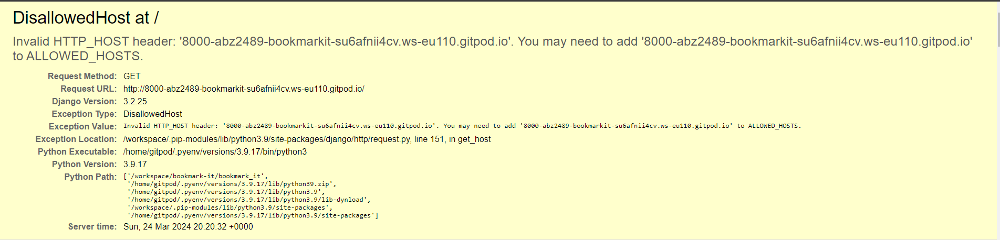
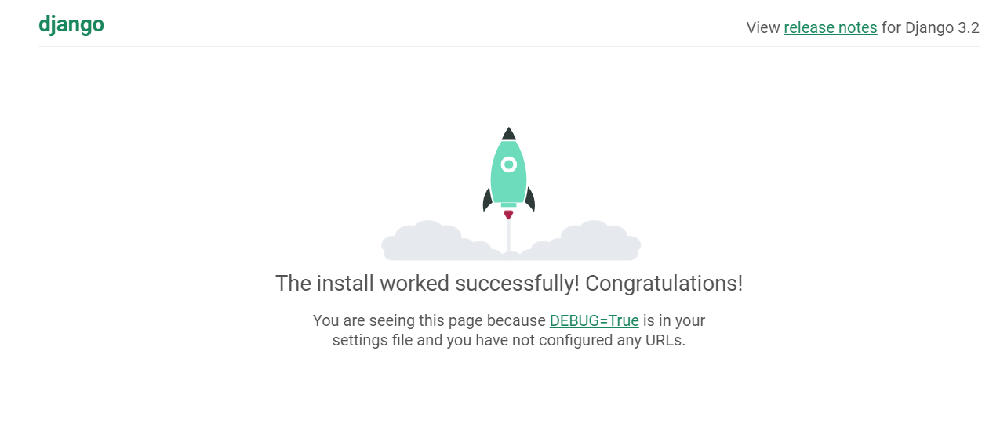

# Bugs

## Bugs & Fixes

1. When launching the project for the very first time after creation I received a 400 error "Invalid HTTP_HOST header". This was an easy fix by following the instructions displayed on the error page I added my request URL  to the ALLOWED_HOSTS section of settings.py within the bookmark-it project folder.

