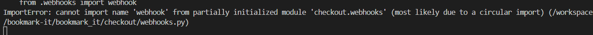

# Bugs

## Bugs & Fixes

1. When launching the project for the very first time after creation I received a 400 error "Invalid HTTP_HOST header". This was an easy fix by following the instructions displayed on the error page I added my request URL  to the ALLOWED_HOSTS section of settings.py within the bookmark-it project folder.


2. db.sqlite3 file is pulling through to github despite being in the .gitignore file. Fixed with the help of Simen Daehlin's very helpful thread in the CI Slack about removing unwanted files using ```git rm -r --cached db.sqlite3 ``` and committing the changes. Due to having to change directory to run the server my db.sqlite3 and requirements.txt files weren't in the root directory.
**Steps taken to fix:**
- Move db.sqlite3 and requirements.txt to the root directory.
- Execute ```git rm -r --cached db.sqlite3 ```
- Commit changes
- Push changes to Github
- Apply migrations ```python3 manage.py migrate```
- Create new super user ```python3 manage.py createsuperuser```

3. The all_books view isn't rendering as a "Home Page" when running the server. Fixed by emptying the path in the project level URLs ```path('books/', include('books.urls'))``` to ```path('', include('books.urls'))```


4. Mobile book search not showing results. Fixed by comparing the mobile search section with the search section in base.html. The name attribute was missing from mobile. 
The first image shows 15 results when the word "children" was searched, this should show 6 as there are only 6 books in the children's category.


5. Back to top button being pushed up to middle of page after moving the overlay closing tag. Fixed by moving the back to top button inside the overlay tags.


6. Quantity increase and decrease buttons on the book summary page aren't working when clicked. The rest of the logic works; disabling the buttons at certain points. Fixed, I was missing a simple hyphen in one of the classes.

7. Quantity increase and decrease buttons work on the book summary page but not on the basket page. I had two different variables for .qty-input in the script; allQtyInputs and allQuantityInputs. Fixed by removing allQuantityInputs and replacing it with allQtyInputs. Both quantity inputs on the book summary page and the basket page now increment and decrement.

8. Basket page not displaying following the addition of my adjust_basket view. The error displayed is "NoReverseMatch at /basket/
Reverse for 'adjust_basket' with arguments '('',)' not found. 1 pattern(s) tried: ['basket/adjust/(?P<book_id>[^/]+)/\\Z']".
Fixed with the help of slack. I had entered the book_id arguement for the form URL and update link URL incorrectly.


9. Adjusting the quantity input on one book in the basket causes all quantity inputs to change. My qty_input.html had the imcrement and decrement being called on the allQtyInputs variable. I switched this to closestInput which has fixed the issue.


10. Clicking the update button throws a type error. Fixed by removing a duplicate adjust_basket url from the update link. This fix highlighted and issue in my views, I forgot to import reverse.

11. Remove link on basket page is throwing a 500 error when clicked.Fixed by adding a trailing slash to the url variable in jquery ```let url = `/basket/remove/${bookId}/`;```

12. Book covers on the books page disappeared after adding media context processor to project level settings. Fixed by removing the {{ MEDIA_URL }}.


13. Import error when trying to run the server due to a circular import. I accidentally imported ```from .webhooks import webhook``` in both webhook_handler.py and webhooks.py. Fixed by removing the import from webhook_handler.py.

